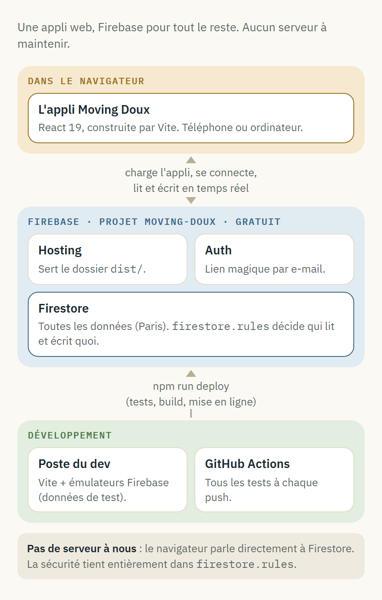
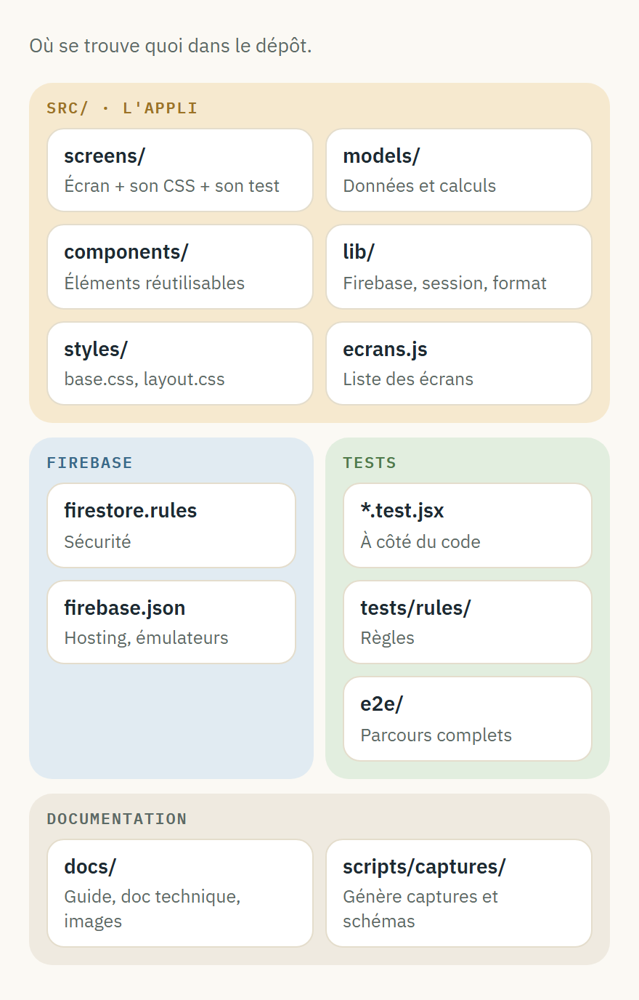
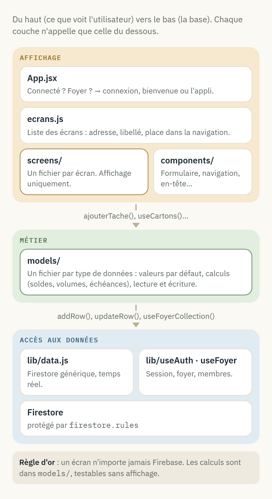
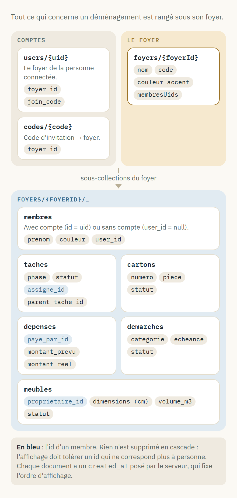
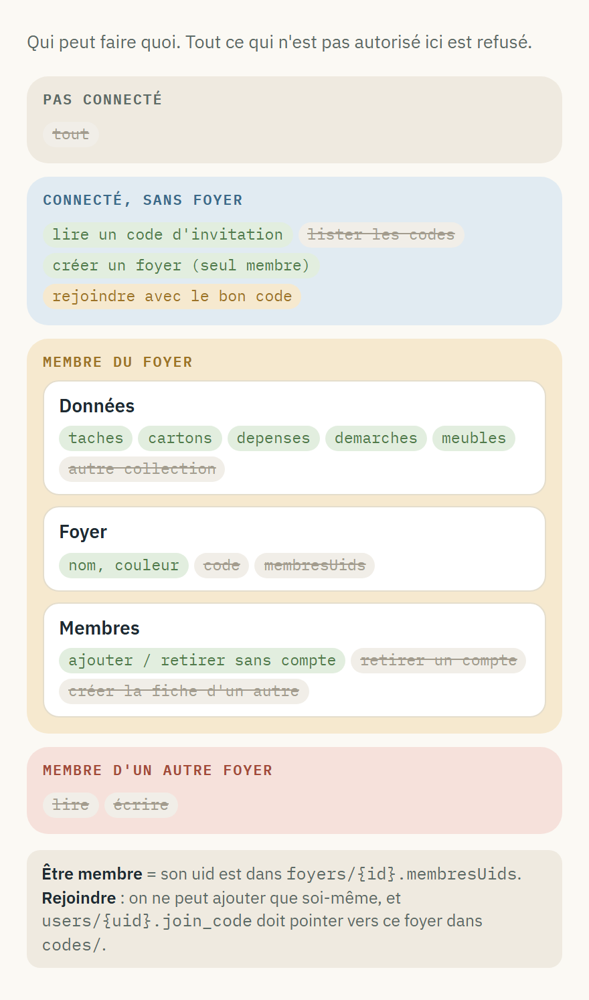
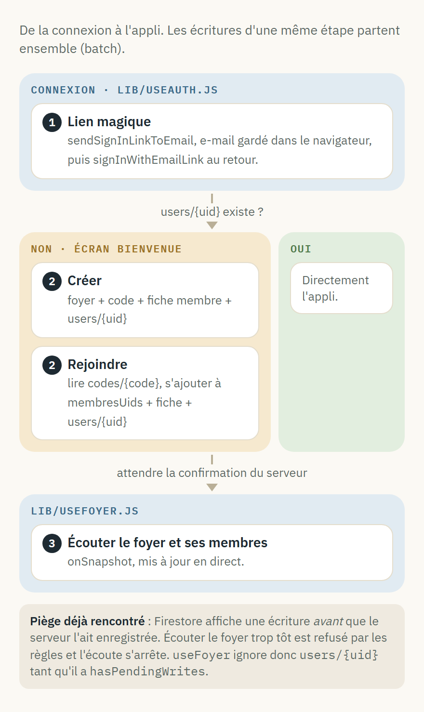
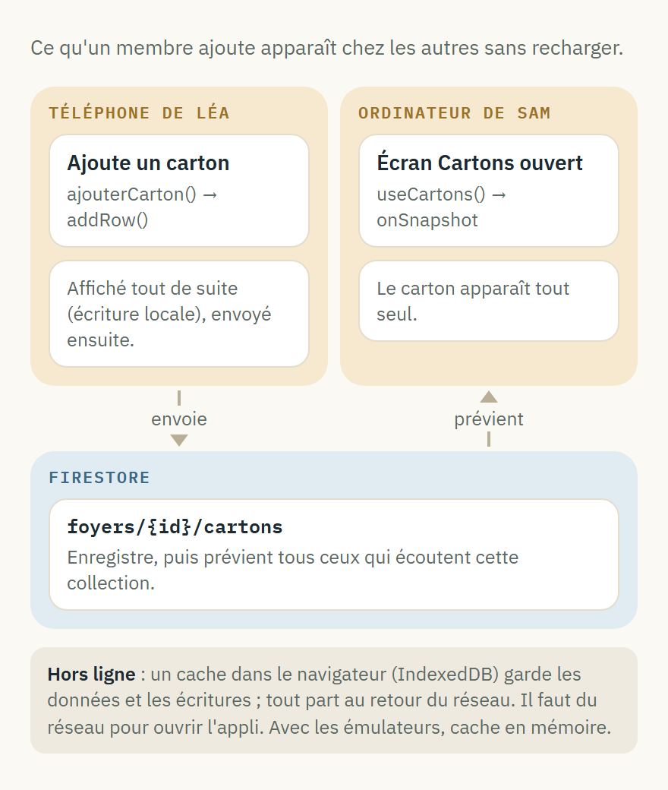
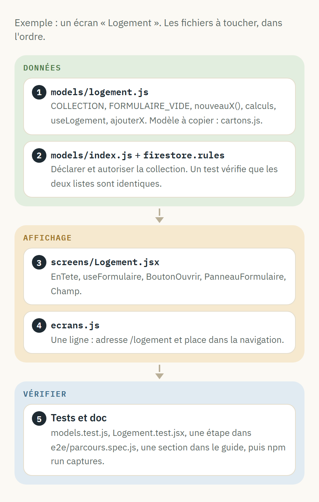
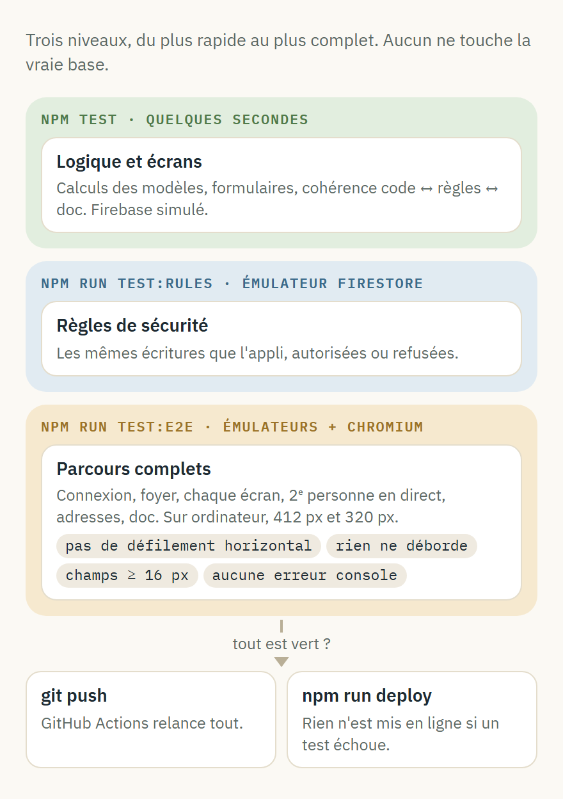

# Documentation technique

> Pour un·e dev qui reprend le projet : un schéma par sujet, puis l'essentiel à savoir pour intervenir.
> Pour l'usage, voir le guide d'utilisation. Pour l'installation pas à pas, voir le README à la racine du dépôt.

## Vue d'ensemble

| | |
| --- | --- |
| Interface | React 19 + Vite, routage `react-router` (une adresse par écran) |
| Données | Cloud Firestore, base `(default)` en `europe-west9`, temps réel via `onSnapshot` |
| Connexion | Firebase Authentication, lien magique par e-mail |
| Hébergement | Firebase Hosting, projet `moving-doux` → moving-doux.web.app |

- **Pas de serveur à nous** : le navigateur parle directement à Firestore, `firestore.rules` protège les données.
- **Tout est gratuit** (formule Spark). Toute évolution doit le rester : pas de Cloud Functions, par exemple.

## Les fichiers

- La configuration Firebase publique est dans `src/firebase.js` : pas de `.env` à créer. Elle bascule sur les émulateurs en mode test.
- Vocabulaire du code en français (`taches`, `ajouterCarton`) ; quelques noms hérités en anglais (`useAuth`, `couleur_accent`).

## Comment l'appli est découpée

- `src/App.jsx` choisit entre chargement, connexion, Bienvenue et l'appli, puis monte une route par écran de `src/ecrans.js`.
- Tous les écrans reçoivent les mêmes props : `foyer`, `membres`, `onSignOut` et les actions du foyer (`addMembreLabel`…).
- Formulaire d'ajout : `src/lib/useFormulaire.js` (état) + `src/components/Formulaire.jsx` (`BoutonOuvrir`, `PanneauFormulaire`, `Champ`).
- Mise en forme partagée : `src/lib/format.js` (dates, euros, champs facultatifs).

## Données (Firestore)

Chemins : `users/{uid}`, `codes/{code}`, `foyers/{foyerId}`, et sous chaque foyer `membres/{id}`, `taches/{id}`, `cartons/{id}`, `depenses/{id}`, `demarches/{id}`, `meubles/{id}`.

- **Statuts** : `a_faire` / `en_cours` / `fait` (`src/models/statuts.js`) ; meubles : `on_garde` / `a_vendre` / `a_acheter` (`src/models/meubles.js`).
- **Dates** (`echeance`, `date`) : texte `AAAA-MM-JJ`, comme les champs `<input type="date">`.
- `volume_m3` est calculé à l'ajout du meuble ; `created_at` est posé par le serveur et fixe l'ordre d'affichage.

## Sécurité (firestore.rules)

- Les règles sont testées une par une dans `tests/rules/firestore.rules.test.js`, avec les mêmes écritures que l'appli.
- Une collection absente de la liste de `firestore.rules` est refusée. Un test vérifie que cette liste et `src/models/index.js` sont identiques.

## Créer ou rejoindre un foyer

- Connexion : `src/lib/useAuth.js`. L'e-mail est gardé dans `localStorage` (`movingdoux-email-connexion`) le temps de cliquer sur le lien.
- Foyer : `src/lib/useFoyer.js`. Les règles valident chaque batch avec `getAfter` (l'état après le batch).
- Le piège en bas du schéma a déjà cassé la création du foyer en production : un test de bout en bout le couvre.

## Temps réel et hors ligne

- `useFoyerCollection(nom, foyerId)` (`src/lib/data.js`) écoute `foyers/{foyerId}/{nom}` trié par `created_at`.
- Chaque modèle expose son hook (`useTaches`, `useCartons`…) : les écrans ne manipulent jamais de nom de collection.

## Styles

- `src/styles/base.css` (couleurs, boutons, cartes, formulaires), `src/styles/layout.css` (mise en page, navigation), puis le CSS de chaque écran, importé par l'écran.
- **Mobile** : un seul point de rupture, `@media (max-width: 720px)`, en bas de chaque fichier. Barre du bas : 4 écrans au plus (`barreMobile` dans `src/ecrans.js`) + « Plus ».
- **Pièges** :
  - `all: unset` remet aussi `box-sizing` à `content-box` : chaque bouton stylé redonne `box-sizing: border-box` ;
  - sur mobile, champs en **16 px minimum**, sinon iOS zoome au toucher ;
  - grilles en `minmax(0, 1fr)` plutôt que `1fr`, sinon un champ élargit la grille au-delà de l'écran.
- `--gold` est remplacée à l'exécution par la couleur d'accent du foyer.

## Ajouter un écran

- **Un nouveau champ** sur des données existantes : l'ajouter au `FORMULAIRE_VIDE` et à `nouveauX()` du modèle, puis un `<Champ>` dans l'écran. Les documents existants n'ont pas ce champ : prévoir une valeur par défaut à l'affichage.
- **Supprimer ou corriger des données à la main** (pas encore d'interface) : console Firebase → Firestore → `foyers/{id}/…`, ou `npx firebase-tools firestore:delete <chemin> --project moving-doux`.

## Où modifier quoi

| Pour… | Aller dans |
| --- | --- |
| Ajouter ou réordonner un écran | `src/ecrans.js` |
| Changer un calcul (soldes, volume, échéances) | `src/models/` |
| Changer la checklist type des démarches | `CHECKLIST_TYPE` dans `src/models/demarches.js` |
| Changer la marge d'empilement des meubles | `MARGE_EMPILEMENT` dans `src/models/meubles.js` |
| Changer les couleurs | `:root` dans `src/styles/base.css` |
| Changer la navigation | `src/components/Sidebar.jsx` et `src/styles/layout.css` |
| Changer qui a le droit de faire quoi | `firestore.rules`, puis `tests/rules/firestore.rules.test.js` |
| Changer les textes de l'aide | `docs/guide-utilisation.md`, `docs/documentation-technique.md` |
| Changer les données des captures | `scripts/captures/donnees.js` |

## Tests

- Les parcours de bout en bout sont dans `e2e/parcours.spec.js` ; les vérifications d'affichage communes dans `e2e/helpers.js` (défilement, débordements, cellules écrasées, navigation, taille des champs) et `e2e/fixtures.js` (erreurs console).
- Firebase est simulé dans les tests d'écrans par `src/test/fakeData.js`.
- `test:rules` et `test:e2e` demandent **Java 21**. Firestore émulé sur le port **8181** (8080 est pris par un service Windows sur le poste de dev), Auth sur 9099.
- Les parcours lancent leur propre serveur (port 5174, branché sur les émulateurs) et s'arrêtent si le port est déjà pris, plutôt que de réutiliser un serveur qui parlerait à la vraie base.

## Images de la documentation

`npm run captures` régénère toutes les images de `docs/`, en une vingtaine de secondes :

- **Captures du guide** (`docs/images/*.jpg`) : l'appli tourne sur les émulateurs avec les données fictives de `scripts/captures/donnees.js` ; chaque scène de `scripts/captures/captures.spec.js` est photographiée à la taille d'un téléphone, avec ses pastilles numérotées (`scripts/captures/annoter.js`).
- **Schémas** (`docs/schemas/*.png`) : une page HTML par schéma dans `scripts/captures/schemas/`, style commun dans `_base.css`.
- Après un changement visible, relancer `npm run captures` et vérifier que les numéros du guide correspondent toujours aux pastilles. Un test échoue si une image citée n'existe pas, ou si une image n'est citée nulle part.

## Commandes

| Commande | Effet |
| --- | --- |
| `npm run dev` | Appli en local, **sur la vraie base**. |
| `npm run dev:emulateurs` | Appli sur des données de test ; le lien de connexion s'affiche dans le terminal. |
| `npm run test:all` | Tous les tests. |
| `npm run captures` | Régénère captures et schémas de la doc. |
| `npm run deploy` | Tests, puis mise en ligne (appli + règles). Le build est lancé automatiquement avant chaque `firebase deploy` (`predeploy` dans `firebase.json`). |

La CI (`.github/workflows/tests.yml`) lance tous les tests à chaque push ; en cas d'échec, les captures et traces Playwright sont jointes au run.

## Limites connues

- Pas de modification ni de suppression des éléments dans l'interface ; pas de sortie de foyer.
- Une personne ne peut appartenir qu'à un foyer (`users/{uid}.foyer_id`).
- Le budget est partagé entre **tous** les membres, y compris les personnes sans compte.
- Numéro de carton = nombre de cartons + 1 : deux ajouts simultanés peuvent avoir le même numéro.
- Notifications push : non branchées (`src/lib/pushNotifications.js` décrit la marche à suivre).
- Lien de connexion : Firebase limite le nombre d'e-mails envoyés par jour sur l'offre gratuite.
