# Guide d'utilisation

> Tout ce qu'il faut pour utiliser Moving Doux, écran par écran. Les numéros bleus des images renvoient aux étapes.
> Pour le fonctionnement interne, voir la documentation technique.

Moving Doux sert à organiser un déménagement à plusieurs : tâches, cartons, budget, démarches et meubles, au même endroit et à jour pour tout le monde en même temps.

## Premiers pas

### Se connecter

Ouvre **moving-doux.web.app**, sur téléphone ou sur ordinateur.

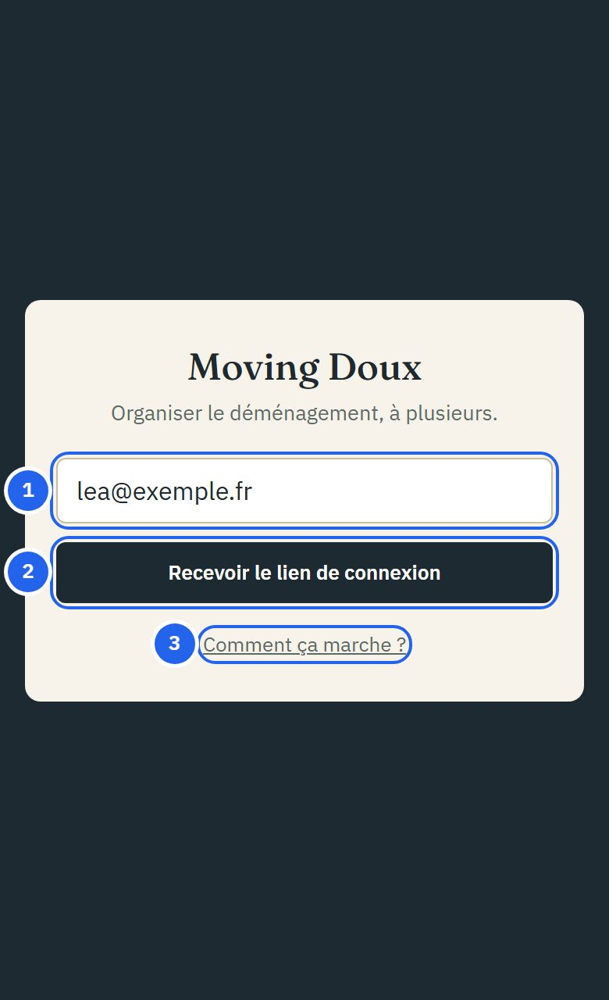

1. Ton adresse e-mail.
2. **Recevoir le lien de connexion** : un e-mail arrive (expéditeur `noreply@moving-doux.firebaseapp.com`, regarde dans les spams la première fois). Clique sur le lien qu'il contient.
3. **Comment ça marche ?** ouvre ce guide, sans compte.

Pas de mot de passe. Tu restes connecté·e sur cet appareil jusqu'à ce que tu te déconnectes.

> Ouvre le lien **dans le même navigateur** que celui où tu l'as demandé. Sinon, l'appli redemande ton adresse : c'est normal.

### Créer le foyer (première personne)

Le **foyer** est l'espace partagé du déménagement : tout ce qui y est ajouté est visible par tous ses membres.

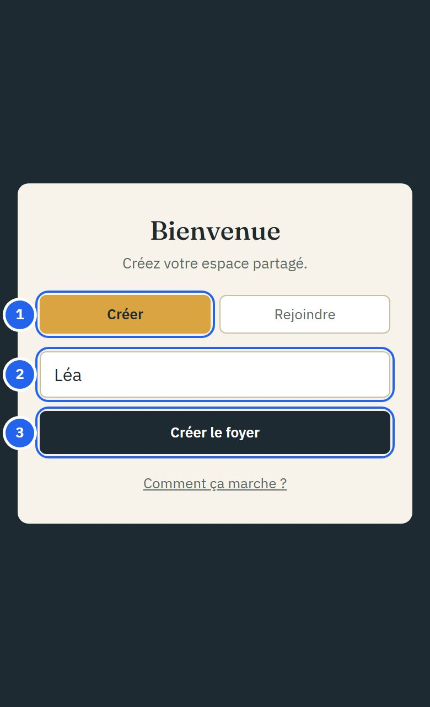

1. Laisse **Créer** sélectionné.
2. Ton prénom.
3. **Créer le foyer**. L'appli s'ouvre sur l'Aperçu.

### Rejoindre un foyer (les personnes suivantes)

La personne qui a créé le foyer te donne son **code** (8 caractères, dans ses Paramètres). Connecte-toi avec **ton propre** e-mail, puis :

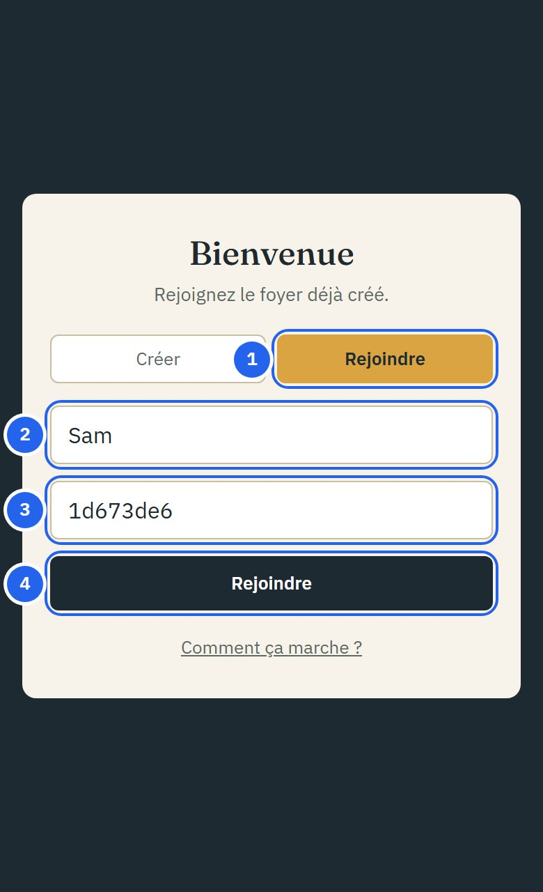

1. Choisis **Rejoindre**.
2. Ton prénom.
3. Le code reçu.
4. **Rejoindre**.

Si « Code introuvable » s'affiche, vérifie le code (sans espace).

## Se repérer

Sur ordinateur, tous les écrans sont listés à gauche. Sur téléphone, la barre en bas contient Aperçu, Tâches, Cartons et Budget ; le reste est dans **Plus** :

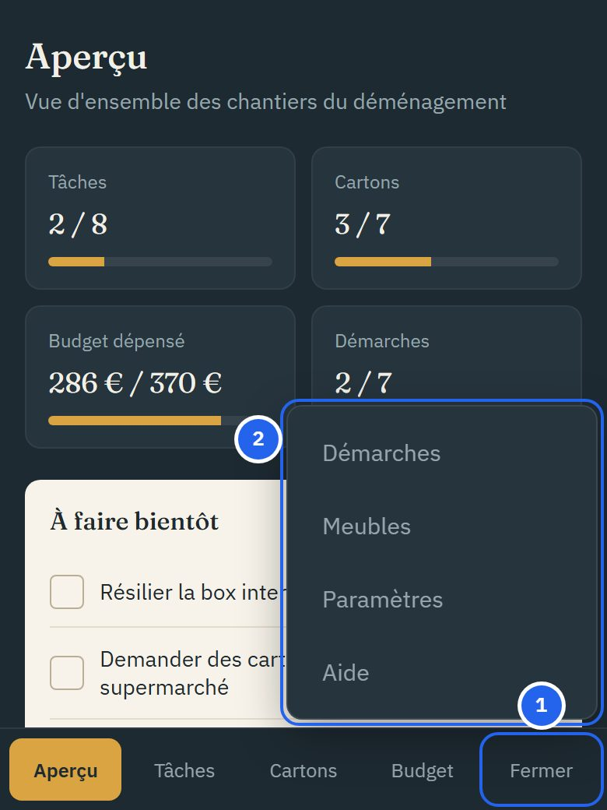

1. **Plus** ouvre le menu ; il devient **Fermer**.
2. Les autres écrans : Démarches, Meubles, Paramètres et cette Aide.

- Ce que les autres ajoutent apparaît **tout seul**, sans recharger la page.
- Si le réseau coupe pendant que l'appli est ouverte, continue : tout est envoyé au retour du réseau. (Il faut du réseau pour ouvrir l'appli.)
- Chaque écran a sa propre adresse (`/budget`, `/meubles`…) : mets-la en favori ou envoie-la.
- Sur chaque écran, **+ Ajouter…** ouvre un formulaire ; **Fermer** ou **Annuler** le referme sans rien enregistrer.

## Aperçu

La page d'accueil résume où vous en êtes.

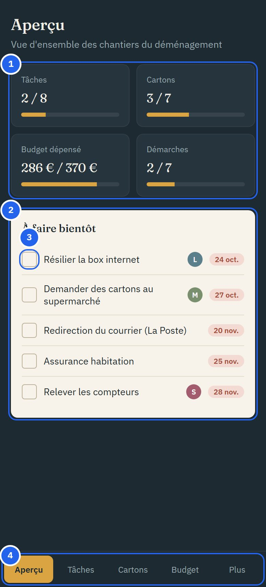

1. **Les compteurs** : tâches, cartons et démarches faits, budget dépensé (réel / prévu).
2. **À faire bientôt** : les 5 tâches ou démarches pas terminées dont l'échéance est la plus proche.
3. **La case** les marque comme faites directement.
4. **La navigation** (barre du bas sur téléphone).

## Tâches

Les tâches sont rangées en trois phases : avant, pendant et après le déménagement.

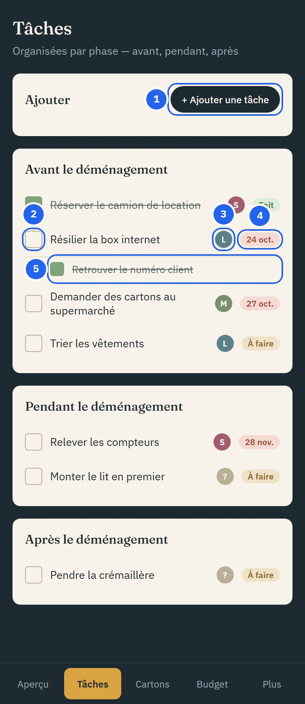

1. **+ Ajouter une tâche** ouvre le formulaire.
2. **La case** termine la tâche. Touche-la à nouveau pour la rouvrir.
3. **L'initiale** de la personne qui s'en occupe (**?** si personne).
4. **L'échéance**, en rouge, ou l'état (À faire, Fait).
5. **Une sous-tâche**, en retrait sous sa tâche principale.

### Ajouter une tâche

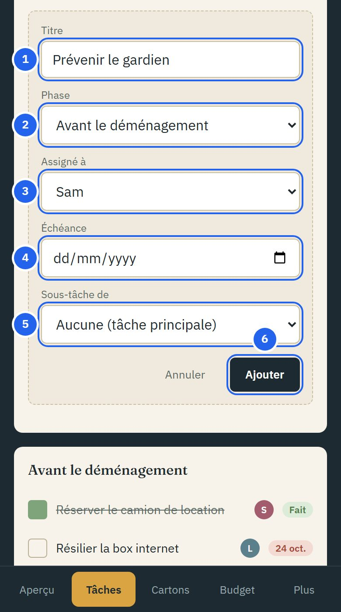

1. **Titre** : obligatoire.
2. **Phase** : avant, pendant ou après.
3. **Assigné à** : qui s'en occupe.
4. **Échéance** : la tâche remonte dans l'Aperçu quand elle approche.
5. **Sous-tâche de** : pour découper une grosse tâche.
6. **Ajouter**.

## Cartons

Les cartons sont regroupés par pièce de destination dans le nouveau logement.

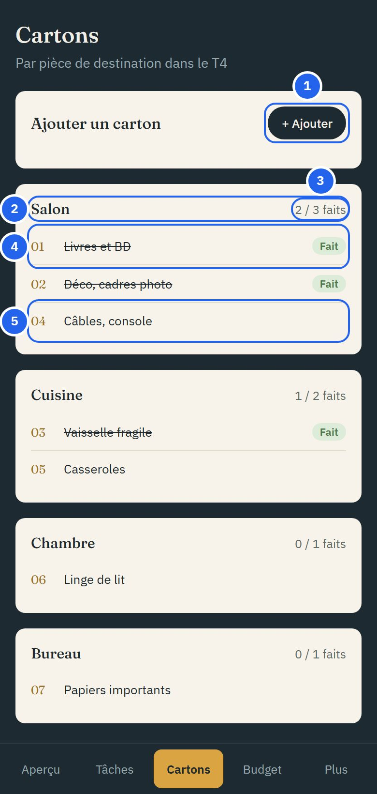

1. **+ Ajouter** : la pièce est obligatoire, le contenu est une description libre (« Livres + déco »).
2. **La pièce** de destination.
3. **L'avancement** de la pièce : cartons faits / total.
4. **Un carton fait** (fermé, prêt) : barré, avec le badge Fait.
5. **Un carton à faire** : touche-le pour le marquer fait (et à nouveau pour annuler).

Chaque carton reçoit un **numéro** automatique (01, 02…) : écris-le sur le carton.

## Budget

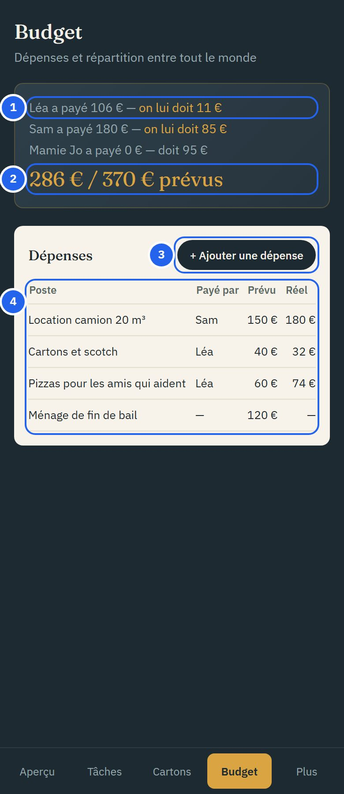

1. **La répartition** : pour chaque membre, ce qu'il a payé et s'il est **à jour**, si **on lui doit** de l'argent ou s'il en **doit**.
2. **Le total** réellement dépensé, et le total prévu.
3. **+ Ajouter une dépense** : le poste est obligatoire ; indique qui a payé, le montant **prévu** et/ou **réel**.
4. **Toutes les dépenses**.

Le total réel est partagé **à parts égales entre tous les membres**, y compris les personnes sans compte ajoutées dans Paramètres. Un écart de moins d'1 € compte comme « à jour ».

## Démarches

Les démarches administratives sont regroupées par catégorie.

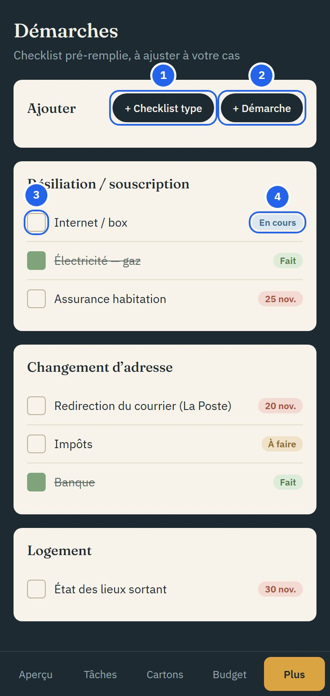

1. **+ Checklist type** ajoute les démarches courantes (box internet, énergie, assurance, La Poste, impôts, banque, état des lieux…). Celles déjà présentes ne sont pas ajoutées en double.
2. **+ Démarche** pour en ajouter une à la main : titre obligatoire, catégorie, organisme, échéance.
3. **La case** passe la démarche à Fait (ou la rouvre).
4. **Le badge** la fait avancer : **À faire** (ou sa date) → **En cours** → **Fait**.

## Meubles

Pour savoir quoi emmener et quel volume annoncer aux déménageurs.

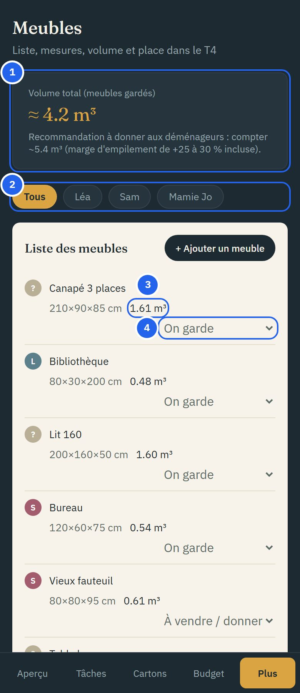

1. **Le volume total** des meubles « On garde », et la recommandation pour les déménageurs (28 % de marge d'empilement en plus).
2. **Les filtres** par propriétaire.
3. **Le volume** de chaque meuble, calculé à partir de ses dimensions.
4. **Le statut** : On garde, À vendre / donner, ou À acheter neuf.

### Ajouter un meuble

**+ Ajouter un meuble**, puis le nom et :

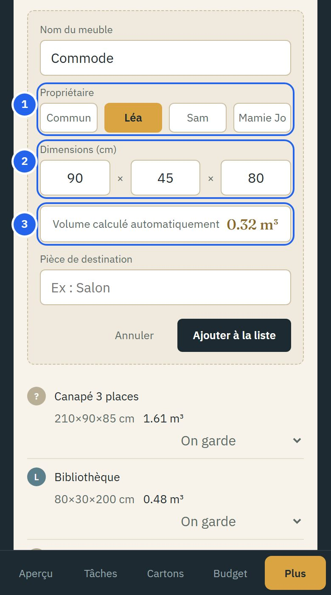

1. **Le propriétaire** : Commun ou un membre.
2. **Les dimensions** en cm (longueur × largeur × hauteur), toutes obligatoires.
3. **Le volume** se calcule pendant la saisie.

## Paramètres

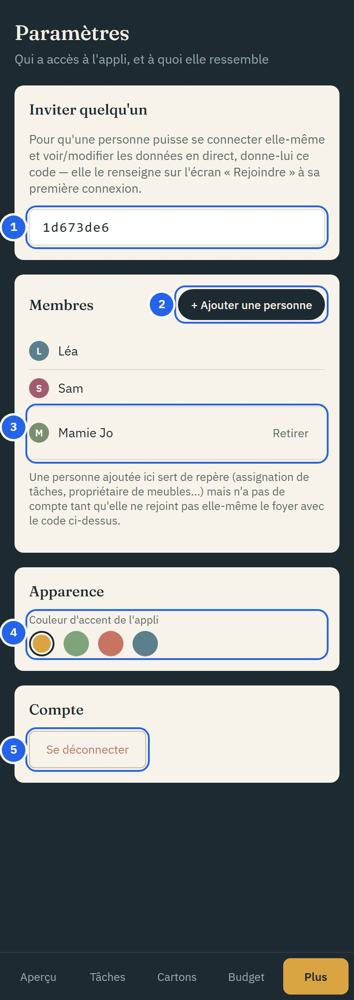

1. **Le code du foyer**, à donner aux personnes à inviter.
2. **+ Ajouter une personne** crée une personne **sans compte** (un parent qui aide, un colocataire…) pour pouvoir lui assigner des tâches, des dépenses ou des meubles.
3. **Une personne sans compte** : seules celles-là peuvent être retirées.
4. **La couleur d'accent** de l'appli, changée pour **tous** les membres.
5. **Se déconnecter** (aussi en bas de la colonne de gauche sur ordinateur).

## Questions fréquentes

### Je ne reçois pas l'e-mail de connexion

Regarde dans les spams, puis redemande un lien. Vérifie l'adresse saisie : chaque personne utilise la sienne.

### Comment me connecter sur un autre appareil ?

Demande un lien de connexion depuis cet appareil : tu retrouves le même foyer.

### Comment modifier ou supprimer une tâche, un carton, une dépense… ?

Ce n'est **pas encore possible** : on peut ajouter et changer le statut, pas modifier le texte ni supprimer. Pour une erreur, ajoute l'élément corrigé ; un développeur peut supprimer l'ancien (voir la documentation technique).

### Quitter un foyer, ou retirer une personne qui a un compte ?

Pas encore possible depuis l'appli.

### Ajouter l'appli à l'écran d'accueil

Sur iPhone : **Partager** > **Sur l'écran d'accueil**. Sur Android : **⋮** > **Ajouter à l'écran d'accueil**.
